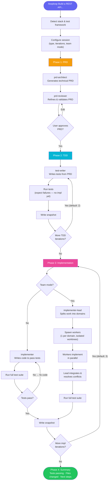
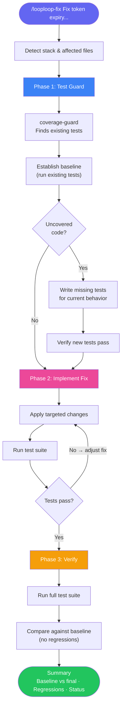

# looploop


XP pair-programming plugin for Claude Code. PRD-driven TDD with iterative implementation.

You define the skeleton. AI places the organs.

## Install

Inside Claude Code, run:

```bash
# Add the marketplace (one-time)
/plugin marketplace add Emerson1337/erms-arsenal

# Install looploop
/plugin install looploop@erms-arsenal
```

Or install manually:

```bash
# Clone directly
git clone git@github.com:Emerson1337/looploop.git ~/.claude/plugins/looploop
```

## Usage

### Full Mode — `/looploop`

For new features and substantial work. Runs the complete pipeline:

```
PRD → TDD → Implement → Iterate
```

```bash
/looploop Build a REST API for user management with JWT auth
```

**What happens:**

1. Detects your stack and test framework
2. Generates a technical PRD (auto-reviewed)
3. Writes tests first — targeting 100% coverage (2 iterations default)
4. Implements code to pass tests (3 iterations default)
5. Presents final summary with results

### Light Mode — `/looploop-fix`

For bugfixes, small features, and refactors. Skips PRD ceremony:

```
Understand → Test Guard → Implement → Verify
```

```bash
/looploop-fix Fix token expiry check that allows expired tokens through
```

**What happens:**

1. Identifies affected files
2. Finds existing tests, establishes baseline (writes missing tests if needed)
3. Makes the fix
4. Verifies no regressions, reports results

### Other Commands

```bash
/looploop-status    # Check current session progress
/looploop-resume    # Resume an interrupted session
/looploop-upgrade   # Upgrade to the latest version
```

## How It Works

### Flow Overview

#### Full Mode — `/looploop`



#### Light Mode — `/looploop-fix`



### Agents

| Agent            | Role                                              |
| ---------------- | ------------------------------------------------- |
| `prd-architect`  | Generates PRD from task description               |
| `prd-reviewer`   | Auto-reviews and refines PRD                      |
| `test-writer`    | Writes tests before implementation (TDD)          |
| `implementer`    | Implements code to pass tests                     |
| `implementer-lead` | Splits PRD into domains, spawns parallel workers (team mode) |
| `coverage-guard` | Finds/writes tests for affected code (light mode) |

### Team Mode

Opt-in during `/looploop` setup when asked "Want to use team mode?"

When enabled, the `implementer-lead` agent replaces `implementer` during Phase 3. Each iteration:

1. **Analyze** — Reads PRD and test results, groups work into independent domains (max 5)
2. **Spawn** — Creates a team with one worker agent per domain, each in an isolated worktree
3. **Coordinate** — Workers implement their scope in parallel; lead resolves conflicts
4. **Integrate** — Merges worker output, fixes wiring/re-exports, runs full test suite

The iteration loop runs normally — each iteration spins up a fresh team. First pass gets the bulk done, subsequent passes target remaining failures.

**When to use:** Large features with multiple independent areas (e.g., auth + API + UI). **When not to use:** Small features, tightly coupled code where parallelism adds overhead.

### Iteration Loop

A stop hook (`hooks/check-iteration.mjs`) reads `.looploop/progress.txt` and continues the current phase if iterations remain. Default iterations:

- TDD phase: 2
- Implementation phase: 3

### Session State

All state lives in `.looploop/` in your project root:

```
.looploop/
├── config.json          # Session configuration
├── progress.txt         # Current phase and iteration
├── prd.md               # PRD (full mode)
├── baseline.txt         # Test baseline (light mode)
└── snapshot-*.md        # Iteration snapshots
```

Add `.looploop/` to your `.gitignore`.

### Why Node.js?

Hook scripts are written in Node.js (`.mjs`). Claude Code already requires Node.js as a runtime dependency, so it's guaranteed to be available on any machine running this plugin. This gives us cross-platform compatibility (macOS, Linux, Windows) without relying on shell-specific syntax like bash or zsh.

## Philosophy

- **XP pair programming**: AI drives, you navigate
- **TDD always**: Tests before implementation, no exceptions
- **Small iterations**: 2-3 passes per phase — enough to refine, cheap on tokens
- **Simple design**: PRD keeps scope tight, out-of-scope is explicit
- **Collective ownership**: PRD, tests, and code are all in the repo

## Credits

Thanks to [Fabio Akita](https://github.com/akitaonrails) for sharing insights.

Inspired by [Ralph Loop](https://github.com/ralphloop).

Looploop wouldn't be done without these.
